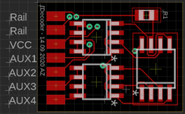
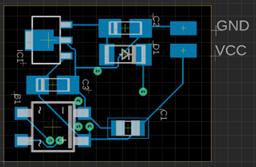
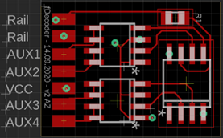
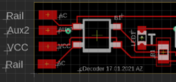
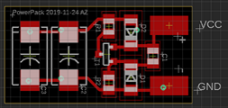

# cDecoder

## Inhalt- [cDecoder](#cdecoder)
- [cDecoder](#cdecoder)
  - [Inhalt- cDecoder](#inhalt--cdecoder)
  - [Funktionen](#funktionen)
  - [Programmierung](#programmierung)
  - [Analog Betrieb](#analog-betrieb)
  - [Powerpack](#powerpack)
  - [Dimmen der Ausgänge](#dimmen-der-ausgänge)
  - [Anschlüsse](#anschlüsse)
    - [fDecoder](#fdecoder)
  - [cDecoder](#cdecoder-1)
  - [PowerPack](#powerpack-1)
  - [Farben](#farben)
  - [CV Tabelle](#cv-tabelle)
    - [Zuordnung Ausgänge zu Funktionstasten](#zuordnung-ausgänge-zu-funktionstasten)
    - [Funktion aktiv bei](#funktion-aktiv-bei)
    - [Modus der Ausgänge](#modus-der-ausgänge)
      - [Blinker On Time](#blinker-on-time)
      - [Blinker off Time](#blinker-off-time)
      - [Dimmen der Ausgänge](#dimmen-der-ausgänge-1)
      - [Automatisches abschalten](#automatisches-abschalten)
      - [Automatisches abschalten](#automatisches-abschalten-1)
  - [Beispiele](#beispiele)
  - [Programmieren des prozessors](#programmieren-des-prozessors)


## Funktionen

- Ein/Aus
- Impuls
- Blinker

## Programmierung

Um den Decoder auf dem Programmiergleis programmieren zu können muss eine Last an AUX 1 angeschlossen werden, die mindestens einen Strom von 60mA erzeugt.

## Analog Betrieb

Wird während 100ms kein DCC Signal erkannt, werden die Funktionen gemäss CV 13 aktiviert

## Powerpack

Ein externes Powerpack kann an den Decoder angeschlossen werden. Dazu können die Pad's VCC und GND auf der Rückseite des Decoders verwendet werden.

## Dimmen der Ausgänge

Die Ausgänge AUX 1 und AUX 2 können gedimmt werden. Die Helligkeit kann über CV 81 und 82 eingestellt werden.

## Anschlüsse

### fDecoder
| oben | unten |
|---|---|
|  |  |
| __v2__ <br>  | |

## cDecoder
| oben | unten |
|---|---|
| ||

## PowerPack
| oben | unten |
|---|---|
|  ||

## Farben

| Draht | Verwendung |
|--------|--------------|
| Rot | Rail |
| Braun | Rail |
| Blau | Decoder + |
| Weiss | Aux 1 / Licht vorne |
| Gelb | Aux 2 / Licht hinten |
| Violett | Aux 3 |
| Grün | Aux 4 |
| Schwarz | GND |

## CV Tabelle

| Bezeichnung | CV | Wertbereich <br> (default) | Beschreibung |
|---|:--------:|---|---|
| Basisadresse | 1 | 1 - 255 (3) | Wertebereich im DCC-Format 1 - 127 |
| | 2 | 120 | |
| | 5 | 255 | |
| Version | 7 | | |
| Hersteller | 8 | | |
| Reset | 8 |  | Durch Eingeben eines Wertes 8, werden alle Einstellungen auf Default gesetzt |
| Im Analogbetrieb aktive Ausgänge | 13 | 0 - 255 (0) | AUX 1 ein = 1<br>AUX 2 ein = 2<br>AUX 3 ein = 4<br>AUX 4 ein = 8<br>AUX 5 ein = 16 |
| Decoderlock | 15 | 0 - 255 (0) | Decoder-Lock Funktion laut NMRA. Details siehe http://www.nmra.org/standards/DCC/WGpublic/0305051/0305051.html |
| Decoderlock | 16 | 0 - 255 (0) | Decoder-Lock Funktion laut NMRA. Details siehe http://www.nmra.org/standards/DCC/WGpublic/0305051/0305051.html |
| Erweiterte Adresse | 17 | 192 - 255 (0) | Nur für DCC-Format. Bei den meisten Zentralen ist es möglich, <br> erweiterte Adressendirekt einzugeben. Die CVs 17, 18 und 29 <br> werden von der Zentrale automatisch richtig eingestellt. |
| Erweiterte Adresse | 18 | 0 - 255 (3) |
| Konfigurationsdaten | 29 | 0 - 64 (2) | Fahrtrichtung Standard = 0 <br>Fahrtrichtung invertiert = 1 <br>14 Fahrstufen = 0 <br>28 oder 128 Fahrstufen 2 <br>Basisadressen = 0 <br>Erweiterte Adressen = 32 |
| Betriebszustand | 122 | 0/1 (0) | Speicher den Betriebszustand der Ausgänge. <br>0 = Aus <br>1 = Ein |

### Zuordnung Ausgänge zu Funktionstasten
| Bezeichnung | CV | Wertbereich <br> (default) | Beschreibung |
|---|:--------:|---|---|
| F0 | 30 | 0 - 31 (3) | AUX 1 = 1 <br> AUX 2 = 2 <br> AUX 3 = 4 <br> AUX 4 = 8 <br> AUX 5 = 16 |
| F1 | 31 | 0 - 31 (4) | |
| F2 | 32 | 0 - 31 (8) | |
| ... | ... | 0 - 31 (0) | |
| F28 | 58 | 0 - 31 (0) | |

### Funktion aktiv bei
| Bezeichnung | CV | Wertbereich <br> (default) | Beschreibung |
|---|:--------:|---|---|
| AUX 1 | 61 | 0 - 31 (1) | Vorwärts = 1 <br> Rückwärts = 2 <br> Beide = 3 <br> Default bei cDecoder ist 3 |
| AUX 2 | 62 | 0 - 31 (2) |
Default bei cDecoder ist 3 |
| AUX 3 | 63 | 0 - 31 (3) | |
| AUX 4 | 64 | 0 - 31 (3) | |
| AUX 5 | 65 | 0 - 31 (3) | |

### Modus der Ausgänge
| Bezeichnung | CV | Wertbereich <br> (default) | Beschreibung |
|---|:--------:|---|---|
| AUX 1 | 66 | 0 - 31 (1) | Ein / Aus = 1 <br> Blinker = 2 <br> Impuls = 3 <br> Ein bei einschalten = 4 (ab Version 3)|
| AUX 2 | 67 | 0 - 31 (1) | |
| AUX 3 | 68 | 0 - 31 (1) | |
| AUX 4 | 69 | 0 - 31 (2) | |
| AUX 5 | 70 | 0 - 31 (2) | |

#### Blinker On Time
| Bezeichnung | CV | Wertbereich <br> (default) | Beschreibung |
|---|:--------:|---|---|
| AUX 1 | 71 | 0 - 255 (100) | Wert x 10 = Zeit in milli Sekunden |
| AUX 2 | 72 | 0 - 255 (100) | |
| AUX 3 | 73 | 0 - 255 (100) | |
| AUX 4 | 74 | 0 - 255 (100) | |
| AUX 5 | 75 | 0 - 255 (100) | |

#### Blinker off Time
| Bezeichnung | CV | Wertbereich <br> (default) | Beschreibung |
|---|:--------:|---|---|
| AUX 1 | 76 | 0 - 255 (100) | Wert x 10 = Zeit in milli Sekunden |
| AUX 2 | 77 | 0 - 255 (100) | |
| AUX 3 | 78 | 0 - 255 (100) | |
| AUX 4 | 79 | 0 - 255 (100) | |
| AUX 5 | 80 | 0 - 255 (100) | |

#### Dimmen der Ausgänge
| Bezeichnung | CV | Wertbereich <br> (default) | Beschreibung |
|---|:--------:|---|---|
| AUX 1 | 81 | 1 - 255 (255) | |
| AUX 2 | 82 | 1 - 255 (255) | |

#### Automatisches abschalten
| Bezeichnung | CV | Wertbereich <br> (default) | Beschreibung |
|---|:--------:|---|---|
| AUX 1 | 86 | 0 - 255 (0) | Wert x 10 = Zeit in milli Sekunden. Ist der <br> Wert grösser als 0 wird der Ausgang nach der <br> eingestellten Zeit wieder abgeschaltet. <br> Ist der Wert 0, dann bleibt der Ausgang eingeschaltet. |
| AUX 2 | 87 | 0 - 255 (0) | |
| AUX 3 | 88 | 0 - 255 (0) | |
| AUX 4 | 89 | 0 - 255 (0) | |
| AUX 5 | 90 | 0 - 255 (0) | |

#### Automatisches abschalten
| Bezeichnung | CV | Wertbereich <br> (default) | Beschreibung |
|---|:--------:|---|---|
| Zustand der Funktionstasten speichern | 122 | 0 / 1 (0) | |

## Beispiele

|Beispiel | Einstellungen |
|---|---|
| SBB Schlusslicht an AUX 4 <br><br><br><br> | 64 = 36 <br> 9 = 27 <br> 4 = 1 (On Time) <br> 79 = 70 (Off Time) |


## Programmieren des prozessors

Um den Prozessor zu programmieren wird ein ISP Programmer benötigt. Der Prozessor kann mit der Arduino IDE programmiert werden. Dazu muss der Prozessor als Board hinzugefügt werden.
- Dazu unter Datei -> Voreinstellungen -> Zusätzliche Boardverwalter-URLs: https://raw.githubusercontent.com/damellis/attiny/ide-1.6.x-boards-manager/package_damellis_attiny_index.json einfügen.
- Arduino AVR Boards installieren unter Werkzeuge -> Board -> Boardverwalter... -> Arduino AVR Boards installieren.
- In der Arduino IDE unter Werkzeuge -> Board -> Boardverwalter... -> attiny auswählen und installieren. 

Danach das Board wie folgt konfigurieren
    Board    : Attiny25/45/85
    Prozessor: Attiny85
    Clock    : Internal 16Mhz
    Programmer: Diamex USB ISP oder ATMEL STK500 (Für Windows 10 ist kein Treiber erforderlich)


Nun kann zuerst der Bootloader und danach die Firmware auf den Prozessor geschrieben werden. Unter visual Micro kommt folgende Fehlermeldung beim schreiben des Bootloaders

```
Error while burning bootloader.
Burn failed
avrdude: can't open input file aders/{bootloader.file}: No such file or directory
avrdude: read from file oaders/{bootloader.file}' failed
```

Dies ist normal, der Attiny hat keine Bootloader visual Micro sucht diesen aber und findet ihn nicht. Die Fuse und Clock settings werden aber geschrieben bevor der Bootloader geschrieben wird.
https://www.visualmicro.com/forums/YaBB.pl?num=1607630288

